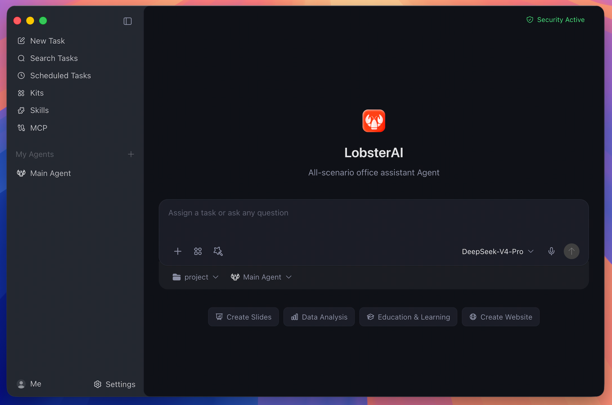

<h1 align="center">
  <br>
  qoowork
</h1>

<p align="center">
  <a href="https://github.com/qoobots/qoowork/stargazers"></a>
  <a href="LICENSE"></a>
  <a href="https://x.com/qooworkYoudao"></a>
  <a href="https://shared.ydstatic.com/market/souti/fihserChatWeb/online/2.0.7/dist/assets/wechat_group-B34qRm1G.png"></a>
  <br>
  
  
  
</p>

<p align="center">
  English · <a href="README_zh.md">中文</a>
</p>

<p align="center">
  <strong>All-scenario office assistant Agent.</strong><br/>
  The first open-source desktop-grade Agent among major Chinese tech companies, built by Qoobot.
</p>

<p align="center">
  <a href="#features"><strong>Features</strong></a>
  &nbsp;·&nbsp;
  <a href="#developing"><strong>Developing</strong></a>
  &nbsp;·&nbsp;
  <a href="#community--support"><strong>Community</strong></a>
</p>

<h3 align="center"><a href="https://qoowork.qoobot.com/#/download-list"><ins>Download qoowork</ins></a></h3>

<p align="center">
  
</p>

qoowork is a desktop Agent that can operate in your real working environment: local files, terminal commands, browser workflows, documents, spreadsheets, slides, IM channels, scheduled jobs, and project workspaces.

Cowork is the qoowork product/session layer. OpenClaw is the runtime and gateway underneath it. That split lets qoowork keep local persistence, permissions, UI state, artifacts, agents, memory, and IM bindings in the desktop app while using OpenClaw for agent execution.

## Features

### Desktop Cowork Sessions

Run long-form Agent tasks against local projects and files. qoowork streams progress, keeps session history, renders tool output, and asks for approval before sensitive actions such as file operations, terminal commands, or network access.

### Multi-Agent Workflows

Create custom Agents with their own identity, model choice, skills, working directory, enabled state, and IM bindings. Keep the Main Agent for general work and use specialized Agents for repeatable roles.

### Expert Kits

Install scenario-oriented Expert Kits that package capability selections and references for common workflows. Kits are selected independently from direct skills, so a workflow can combine curated kits with individual tools.

### Skills

qoowork ships with 28 built-in skills configured in `SKILLs/skills.config.json`, including web search, Word documents, spreadsheets, PowerPoint, PDF processing, Remotion video generation, browser automation, image/video generation, stock research, content writing, email, weather, and skill creation.

### MCP Servers

Connect external tools and data sources through Model Context Protocol servers. qoowork stores user-configured servers locally and syncs enabled servers into OpenClaw.

### Scheduled Tasks

Create recurring work either by conversation or through the scheduled task UI. Use it for daily news digests, inbox summaries, website monitoring, weekly reports, and other repeatable work.

### IM Remote Control

Reach your desktop Agent from WeChat, WeCom, DingTalk, Feishu/Lark, QQ, Telegram, Discord, Qoobot IM, Qoobot Bee, POPO, and email. Multi-instance platforms can bind different accounts or channels to different Agents.

### Rich Artifacts

Preview and manage generated HTML, SVG, images, video, Mermaid diagrams, code, Markdown, text, documents, and local service artifacts inside the desktop app.

### Local Memory And Data

Sessions and app data live locally in SQLite. OpenClaw workspace memory uses files such as `MEMORY.md`, `USER.md`, `SOUL.md`, and daily notes, so durable preferences and project context can carry across sessions.

## Real-World Prompts

| Scenario | Example prompt |
| --- | --- |
| Build a local system | "I still track inventory and sales in Excel. Build a local inventory system that records purchases and sales, calculates stock and profit, and opens in my browser." |
| Analyze local data | "Use `product-growth.xlsx` to build a visual dashboard and summarize the main growth drivers." |
| Generate a deck | "Research the AI Agent market and turn the findings into a presentation." |
| Automate browser checks | "Open the ads dashboard every morning, check spend and conversion anomalies, and summarize likely causes." |
| Screen documents | "Turn the resumes in this folder into a screening sheet and shortlist the strongest candidates against the JD." |
| Run scheduled work | "Every weekday at 9 AM, collect yesterday's AI news and send me a concise digest." |

## How It Works

<p align="center">
  
</p>

- **Renderer**: React, Redux Toolkit, Tailwind, artifact renderers, settings, agent/session UI, skills, MCP, scheduled tasks, and IM configuration.
- **Main process**: Electron lifecycle, IPC, SQLite persistence, auth, logging, OpenClaw startup, runtime repair, skill sync, IM gateways, and artifact services.
- **OpenClaw integration**: `openclawEngineManager`, `openclawConfigSync`, `openclawRuntimeAdapter`, and `coworkEngineRouter` translate qoowork state into OpenClaw runtime behavior.

## Install

### Desktop

Download the latest macOS and Windows installers from [Official Website](https://qoowork.qoobot.com/) or [GitHub Releases](https://github.com/qoobots/qoowork/releases).

### Run From Source

Requirements:

- Node.js `>=24.15.0 <25`
- npm

```bash
git clone https://github.com/qoobots/qoowork.git
cd qoowork
npm install
```

First development run:

```bash
npm run electron:dev:openclaw
```

Daily development after the pinned OpenClaw runtime exists:

```bash
npm run electron:dev
```

The renderer dev server runs at `http://localhost:5175`.

## Developing

```bash
# Production renderer bundle
npm run build

# Electron main/preload TypeScript build
npm run compile:electron

# Official Vitest entry used by CI
npm test

# Full ESLint across src; may expose existing legacy debt
npm run lint

# CI-style lint for touched TypeScript files
npx eslint --ext ts,tsx --report-unused-disable-directives --max-warnings 0 <files>
```

### OpenClaw Runtime

The pinned OpenClaw version and third-party plugin list live in `package.json` under `openclaw`.

```bash
# Build the current-platform runtime manually
npm run openclaw:runtime:host

# Use a custom OpenClaw source checkout
OPENCLAW_SRC=/path/to/openclaw npm run electron:dev:openclaw

# Force runtime rebuild
OPENCLAW_FORCE_BUILD=1 npm run electron:dev:openclaw

# Keep a local OpenClaw checkout on its current branch/tag
OPENCLAW_SKIP_ENSURE=1 npm run electron:dev:openclaw
```

## Packaging

<details>
<summary>Build desktop installers</summary>

```bash
# macOS
npm run dist:mac
npm run dist:mac:x64
npm run dist:mac:arm64
npm run dist:mac:universal

# Windows
npm run dist:win

# Linux
npm run dist:linux
```

Packaging bundles the OpenClaw runtime under `Resources/cfmind`. Windows builds also bundle a portable Python runtime under `resources/python-win`, so end users do not need to install Python manually.

Offline or private-source packaging can use:

- `qoowork_PORTABLE_PYTHON_ARCHIVE`
- `qoowork_PORTABLE_PYTHON_URL`
- `qoowork_WINDOWS_EMBED_PYTHON_VERSION`
- `qoowork_WINDOWS_EMBED_PYTHON_URL`
- `qoowork_WINDOWS_GET_PIP_URL`

</details>

## Project Map

| Path | Purpose |
| --- | --- |
| `src/main/main.ts` | Electron lifecycle, IPC registration, auth, logging, runtime startup, and service wiring |
| `src/main/libs/openclawEngineManager.ts` | OpenClaw gateway process, runtime state, ports, logs, restart, and repair |
| `src/main/libs/openclawConfigSync.ts` | Renders qoowork providers, models, agents, IM bindings, skills, MCP, and workspace instructions into OpenClaw config |
| `src/main/libs/agentEngine/openclawRuntimeAdapter.ts` | Translates OpenClaw gateway events into Cowork stream events |
| `src/main/coworkStore.ts` | Cowork sessions, messages, config, agents, memory metadata, and SQLite CRUD |
| `src/renderer/components/cowork/` | Main Cowork UI, prompt input, session detail, permissions, thinking/tool display, media, and voice input |
| `src/renderer/components/agent/` | Agent creation and settings UI |
| `src/renderer/components/skills/` | Skill management UI |
| `src/renderer/components/mcp/` | MCP server management UI |
| `src/renderer/components/scheduledTasks/` | Scheduled task list, form, detail, run history, and templates |
| `src/renderer/services/i18n.ts` | Renderer i18n dictionary and `t()` helper |
| `SKILLs/` | Bundled qoowork skills |

## Security And Data

- Renderer windows use context isolation, disabled Node integration, and sandboxing.
- Renderer-to-main access goes through preload IPC APIs.
- Sensitive tool actions are permission-gated and logged.
- App data is stored locally in `qoowork.sqlite` under Electron `userData`.
- OpenClaw state, workspace memory, generated config, and gateway logs live under `userData/openclaw`.

## Community & Support

Join the WeChat group for help, feedback, and release updates:

<p align="center">
  
</p>

Please use the repository issue templates for bugs and feature requests. For pull requests, include a short summary, linked issue when relevant, screenshots for UI changes, and notes for Electron-specific behavior such as IPC, storage, runtime, or windowing changes.

## Star History

[](https://www.star-history.com/#qoobots/qoowork&type=date&legend=top-left)

## License

[AGPL-3.0 License](LICENSE)

Built and maintained by [Qoobot](https://www.qoobot.com/).
