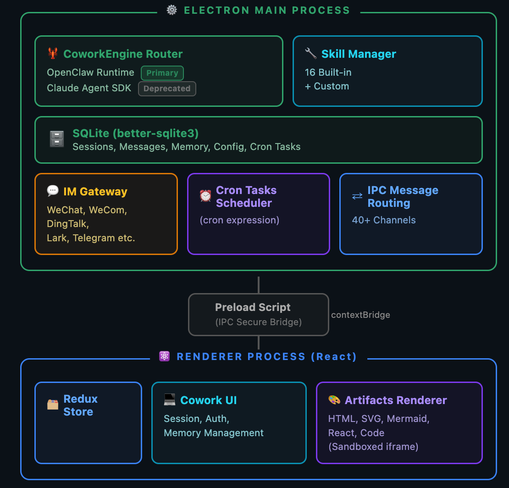

<h1 align="center">
  <br>
  qoowork
</h1>

<p align="center">
  <a href="https://github.com/qoobots/qoowork/stargazers"></a>
  <a href="LICENSE"></a>
  <a href="https://x.com/qooworkYoudao"></a>
  <a href="https://shared.ydstatic.com/market/souti/fihserChatWeb/online/2.0.7/dist/assets/wechat_group-B34qRm1G.png"></a>
  <br>
  
  
  
  
  
  
  
</p>

<p align="center">
  English · <a href="README_zh.md">中文</a>
</p>

<p align="center">
  <strong>All-scenario desktop-grade AI Agent.</strong><br/>
  Bring AI into your real working environment: local files, terminal, browser, IM channels,<br/>
  one window to go from idea to delivery.<br/>
  <em>The first open-source desktop Agent among major Chinese tech companies, built by Qoobot.</em>
</p>

<p align="center">
  <a href="#quick-start"><strong>Quick Start</strong></a>
  &nbsp;·&nbsp;
  <a href="#core-features"><strong>Core Features</strong></a>
  &nbsp;·&nbsp;
  <a href="#real-world-scenarios"><strong>Scenarios</strong></a>
  &nbsp;·&nbsp;
  <a href="#architecture"><strong>Architecture</strong></a>
  &nbsp;·&nbsp;
  <a href="#tech-stack"><strong>Tech Stack</strong></a>
  &nbsp;·&nbsp;
  <a href="#local-development"><strong>Development</strong></a>
  &nbsp;·&nbsp;
  <a href="#project-structure"><strong>Structure</strong></a>
  &nbsp;·&nbsp;
  <a href="#community--support"><strong>Community</strong></a>
</p>


---

## What is qoowork?

**qoowork** is a desktop Agent that can operate in your real working environment. It is not a simple chat window — it can:

- 📁 **Read and write local files**, edit code, process documents, manipulate spreadsheets
- 🖥️ **Execute terminal commands**, set up dev environments, run scripts, manage systems
- 🌐 **Control browsers**, operate web dashboards, auto-fill forms, scrape data
- 📊 **Generate visual deliverables**: HTML dashboards, SVG charts, videos, PowerPoint presentations
- 💬 **Connect via IM channels**, remotely control your Agent through WeChat, DingTalk, Feishu/Lark, and more
- ⏰ **Automate on schedule**, daily news digests, data monitoring, weekly reports

### Design Philosophy

qoowork uses a **dual-layer architecture**:

- **Cowork** — the product and session layer, handling local persistence, permission control, UI state management, artifact rendering, agent management, memory system, and IM bindings in the desktop app
- **OpenClaw** — the underlying runtime and gateway for agent execution, tool calling, model inference, and streaming event dispatch

> This split lets the desktop layer focus on user experience and data security while core AI capabilities are carried by the independent OpenClaw runtime.

---

## Quick Start

### Option 1: Install (Recommended)

Download the latest macOS or Windows installer from the [Official Website](https://qoowork.qoobot.com/#/download-list) or [GitHub Releases](https://github.com/qoobots/qoowork/releases). Ready to use out of the box.

### Option 2: Run from Source

```bash
# Requirements: Node.js >= 24.15.0 < 25
git clone https://github.com/qoobots/qoowork.git
cd qoowork
npm install

# First run (build OpenClaw runtime + start app)
npm run electron:dev:openclaw

# Daily development
npm run electron:dev
```

### Configure Models

After launching, go to **Settings → Model Configuration** and add your API Provider:

| Provider | Required Configuration |
| --- | --- |
| OpenAI Compatible | API Key + Base URL + Model name |
| Tongyi Qianwen | API Key |
| DeepSeek | API Key |
| Custom | Any OpenAI-compatible endpoint |

You can configure multiple models and switch freely during sessions.

### Your First Task

Try these getting-started prompts:

```
"Generate a daily to-do HTML page with add, complete, and delete functionality, and open it in the browser."
```

```
"Analyze README.md in the current folder, extract the key content, and generate a mind map."
```

---

## Core Features

### 🖥️ Desktop Cowork Sessions

Run **long-form tasks** against local projects and files. qoowork will:

- Stream the Agent's thinking, tool calls, and intermediate results in real time
- Fully preserve session history with search, fork, and traceback
- **Request manual approval** for sensitive actions such as file operations, terminal commands, and network access
- Visualize context token usage so you can track consumption

### 🤖 Multi-Agent Workflows

- **Main Agent** for general work
- **Specialized Agents** for repeatable roles: code reviewer, data analyst, document generator, and more
- Each Agent has its own identity, model, skill set, working directory, and IM binding
- Supports session forking and sub-agent delegation

### 🧩 Expert Kits

- Scenario-oriented capability packages: install a set of related skills and references at once
- For example, an "Earnings Report Kit" bundles Excel processing, chart generation, financial metric calculation, and PowerPoint output skills
- Kits and individual skills coexist independently — combine curated kits with individual tools

### 🛠️ Skills

The `SKILLs/` directory ships with **28+ built-in skills**, ready to use:

| Category | Skills |
| --- | --- |
| 📝 Documents | Word (.docx), Excel (.xlsx), PowerPoint (.pptx), PDF processing, Markdown |
| 🌐 Web | Web search, browser automation, page scraping |
| 🎨 Media | Image generation, video generation (Remotion), SVG rendering |
| 📊 Data | Data visualization, stock research, trend analysis |
| 📧 Communication | Email composition and sending, weather lookup |
| 🔧 Tools | Skill creation, Playwright testing, content writing |
| 🗣️ Voice | Voice input |

Skills can be toggled on/off via the UI, and third-party skill packages can be installed.

### 🔌 MCP Servers

Connect external tools and data sources via **Model Context Protocol**:

- MCP server configs stored locally — data ownership stays with you
- Enabled MCP servers auto-sync to the OpenClaw runtime
- MCP marketplace for discovering and installing community servers
- Compatible with stdio, SSE, and other transport protocols

### ⏰ Scheduled Tasks

- Create recurring tasks with **natural language** — no cron expressions needed
- Visual scheduled task UI: task list, run history, next execution time
- Built-in templates: daily news, email digest, website monitoring, weekly report, data backup
- Task results auto-saved, with retry and notification on failure

### 💬 IM Remote Control

Bring your Agent into everyday chat tools — control it remotely from anywhere:

| Platform | Status |
| --- | --- |
| WeChat | ✅ Supported |
| WeCom | ✅ Supported |
| DingTalk | ✅ Supported |
| Feishu / Lark | ✅ Supported |
| QQ | ✅ Supported |
| Telegram | ✅ Supported |
| Discord | ✅ Supported |
| Email | ✅ Supported |
| NetEase Yunxin IM | ✅ Supported |
| NetEase Bee | ✅ Supported |
| POPO | ✅ Supported |

- Multi-instance support: different accounts/channels bound to different Agents
- IM conversations automatically map to Cowork sessions with persistent context

### 📦 Rich Artifacts

Agent-generated deliverables are **previewed and managed directly** in the desktop app:

| Artifact Type | Rendering |
| --- | --- |
| HTML / SVG | Sandboxed browser rendering |
| Mermaid diagrams | Real-time SVG visualization |
| Code | Syntax highlighting + line numbers |
| Images / Video | Media player |
| Markdown | Rich-text rendering |
| Documents | File directory view |
| Local services | Port forwarding preview |

All artifacts are persistently stored and will not be lost when sessions close.

### 🧠 Local Memory and Data

- **SQLite local storage**: sessions, messages, configs, and agent definitions saved in `qoowork.sqlite`
- **OpenClaw workspace memory**: `MEMORY.md` for durable facts, `USER.md` for user profile, `SOUL.md` for Agent personality
- **Daily notes**: `memory/YYYY-MM-DD.md` automatically captures daily work context
- **Cross-session continuity**: preferences and project context persist across sessions

---

## Real-World Scenarios

### 🏗️ Local System Building

| Prompt | Result |
| --- | --- |
| "Build me an inventory management system that tracks purchases and sales, auto-calculates stock and profit, with browser preview." | Full web application |
| "Create a local photo manager with search and pagination that reads images from the current folder." | Files + web integration |

### 📊 Data Analysis and Visualization

| Prompt | Result |
| --- | --- |
| "Build a visual dashboard from `sales-2025.xlsx` and summarize the growth drivers." | Excel → charts + analysis |
| "Analyze `server.log`, find the TOP 10 errors, and suggest fixes." | Log analysis + diagnostics |

### 📑 Documents and Reports

| Prompt | Result |
| --- | --- |
| "Research the AI Agent market landscape and create a presentation." | Research → structured PPT |
| "Consolidate the design docs in the `specs` folder into an architecture overview." | Multi-doc synthesis |
| "Translate README.md into English and keep the formatting." | Translation + layout |

### 🌐 Browser Automation

| Prompt | Result |
| --- | --- |
| "Every morning, open the ads dashboard, check spend and conversion anomalies, and summarize likely causes." | Web monitoring + daily report |
| "Scrape competitor pricing pages and build a comparison table." | Data collection + processing |

### ⏰ Scheduled Automation

| Prompt | Result |
| --- | --- |
| "Every weekday at 9 AM, collect yesterday's AI news and send a concise digest." | Scheduled + summary |
| "Every Friday at 5 PM, tally this week's Git commits and generate a weekly report." | Git + scheduled report |
| "Check the server status page every hour and notify me via WeChat if it goes down." | Monitoring + IM alert |

### 💬 Remote Work

| Prompt | Result |
| --- | --- |
| "Ask the Agent via WeChat 'analyze today's sales data' — the Agent runs on the desktop and replies via WeChat." | IM remote control |
| "While on a business trip, use Feishu to have the Agent generate the client's PPT and send it by email." | Remote + documents + email |

---

## Architecture

<p align="center">
  
</p>

### Three-Layer Architecture

```
┌─────────────────────────────────────────────┐
│                  Renderer                     │
│  React + Redux + Tailwind                     │
│  Cowork UI │ Agent Mgmt │ Artifact Preview    │
│  Skills/MCP/Scheduled/IM Config              │
├─────────────────────────────────────────────┤
│                Main Process                   │
│  Electron Lifecycle │ IPC │ SQLite            │
│  Auth │ Logging │ Runtime Mgmt │ Skill Sync   │
│  IM Gateways │ Artifact Services             │
├─────────────────────────────────────────────┤
│              OpenClaw Runtime                 │
│  Agent Execution │ Tool Calling │ Inference    │
│  Streaming Events │ Workspace Memory          │
└─────────────────────────────────────────────┘
```

### Key Modules

| Module | File | Responsibility |
| --- | --- | --- |
| **App Entry** | `src/main/main.ts` | Electron lifecycle, IPC registration, auth, logging, runtime startup, service wiring |
| **Runtime Manager** | `src/main/libs/openclaw/openclawEngineManager.ts` | OpenClaw gateway process lifecycle, health monitoring, port assignment, log collection, restart/repair |
| **Config Sync** | `src/main/libs/openclaw/openclawConfigSync.ts` | Renders qoowork providers, models, agents, IM bindings, skills, MCP, and workspace instructions into OpenClaw config |
| **Event Adapter** | `src/main/libs/agentEngine/openclawRuntimeAdapter.ts` | Translates OpenClaw gateway events into Cowork stream event format |
| **Router** | `src/main/libs/agentEngine/coworkEngineRouter.ts` | Cowork runtime router — currently routes to OpenClaw only |
| **Data Store** | `src/main/coworkStore.ts` | Cowork sessions, messages, config, agents, and memory metadata CRUD |
| **Agent Manager** | `src/main/agentManager.ts` | Agent creation, update, deletion, and preset template installation |
| **Skill Manager** | `src/main/skillManager.ts` | Built-in/user skill sync, install/upgrade, security scan, enable state, and routing configuration |
| **IM Gateways** | `src/main/im/` | Multi-platform IM config, status, message delivery, session mapping, media handling, and pairing |
| **MCP Services** | `src/main/mcp/` | MCP storage, runtime, marketplace, and launch resolution |

---

## Tech Stack

| Layer | Technology | Version |
| --- | --- | --- |
| **Desktop Framework** | Electron | 40 |
| **Frontend Framework** | React | 18 |
| **State Management** | Redux Toolkit | — |
| **UI Styling** | Tailwind CSS | — |
| **Build Tool** | Vite | 6 |
| **Type System** | TypeScript | 5 |
| **Test Framework** | Vitest | — |
| **Linting/Formatting** | ESLint + Prettier | — |
| **Git Standards** | Commitlint + Husky | — |
| **Local Storage** | SQLite (better-sqlite3) | — |
| **Logging** | electron-log | — |
| **Packaging** | electron-builder | — |
| **AI Runtime** | OpenClaw | v2026.6.1 |

### Development Requirements

| Dependency | Version |
| --- | --- |
| Node.js | `>= 24.15.0 < 25` |
| npm | Bundled with Node.js |
| Git | Any modern version |

---

## Local Development

### Common Commands

```bash
# First launch (build OpenClaw runtime + start)
npm run electron:dev:openclaw

# Daily development (Vite HMR + Electron)
npm run electron:dev

# Production build
npm run build

# Electron main/preload TypeScript compilation
npm run compile:electron

# Run tests
npm test                     # Full Vitest suite
npm test -- cowork           # Cowork-related tests only
npm test -- logger           # Logger-related tests only

# Linting
npm run lint                 # Full ESLint (may expose legacy debt)
npx eslint --ext ts,tsx --report-unused-disable-directives --max-warnings 0 <files>

# Packaging
npm run dist:mac             # macOS
npm run dist:win             # Windows
npm run dist:linux           # Linux
```

### OpenClaw Runtime Build

OpenClaw is built as a separate runtime component. The pinned version and plugin list are defined in `package.json` under the `openclaw` field.

```bash
# Full build (recommended)
npm run openclaw:runtime:host

# Step-by-step control
npm run openclaw:ensure      # Fetch source
npm run openclaw:patch       # Apply patches
npm run openclaw:bundle      # Bundle gateway
npm run openclaw:plugins     # Install plugins
npm run openclaw:prune       # Prune unused files

# Environment variables
OPENCLAW_SRC=/path/to/openclaw           # Custom source path
OPENCLAW_SKIP_ENSURE=1                   # Skip version check
OPENCLAW_FORCE_BUILD=1                   # Force rebuild
```

### Packaging Notes

Packaging bundles the OpenClaw runtime into `Resources/cfmind` in the installer.

<details>
<summary>Detailed packaging options (click to expand)</summary>

```bash
# macOS architecture options
npm run dist:mac               # Current architecture
npm run dist:mac:x64           # Intel
npm run dist:mac:arm64         # Apple Silicon
npm run dist:mac:universal     # Universal binary

# Windows
npm run dist:win

# Linux
npm run dist:linux
```

**Offline packaging**: Windows builds download a portable Python runtime by default. For offline environments, use these environment variables to specify local paths:

- `qoowork_PORTABLE_PYTHON_ARCHIVE` — Local Python archive path
- `qoowork_PORTABLE_PYTHON_URL` — Private source URL
- `qoowork_WINDOWS_EMBED_PYTHON_VERSION` — Python version
- `qoowork_WINDOWS_EMBED_PYTHON_URL` — Python download URL
- `qoowork_WINDOWS_GET_PIP_URL` — get-pip.py URL

</details>

---

## Project Structure

```
qoowork/
├── src/
│   ├── main/                    # Electron main process
│   │   ├── main.ts              # App entry, lifecycle management
│   │   ├── preload.ts           # Preload script, IPC bridge
│   │   ├── coworkStore.ts       # Cowork data store
│   │   ├── sqliteStore.ts       # SQLite init and migration
│   │   ├── agentManager.ts      # Agent CRUD
│   │   ├── skillManager.ts      # Skill sync management
│   │   ├── setup/               # Boot-time constants and types
│   │   ├── libs/
│   │   │   ├── openclaw/        # OpenClaw integration (engine, config, sync)
│   │   │   ├── auth/            # Authentication (GitHub Copilot, OpenAI Codex)
│   │   │   ├── update/          # App update management
│   │   │   └── agentEngine/     # Runtime adapters and routing
│   │   ├── im/                  # IM gateways (WeChat/DingTalk/Feishu/etc.)
│   │   └── mcp/                 # MCP server management
│   ├── renderer/                # React renderer process
│   │   ├── App.tsx              # Top-level app component
│   │   ├── store/               # Redux Store + Slices
│   │   ├── services/            # IPC wrappers + business services
│   │   └── components/
│   │       ├── cowork/          # Main session UI
│   │       ├── agent/           # Agent management UI
│   │       ├── agentSidebar/    # Sidebar navigation
│   │       ├── artifacts/       # Artifact preview panel
│   │       ├── skills/          # Skill management UI
│   │       ├── mcp/             # MCP management UI
│   │       └── scheduledTasks/  # Scheduled task UI
│   └── shared/                  # Main/renderer shared code
│       ├── agent/
│       ├── cowork/
│       ├── mcp/
│       └── providers/
├── SKILLs/                      # Built-in skills (28+)
├── scripts/                     # Build tooling
├── docs/                        # Documentation
│   ├── 03_开发/                 # Development guides
│   └── 04_集成/                 # Integration docs
├── tests/                       # Test files
├── resources/                   # Packaging resources
├── public/                      # Static assets (icons, etc.)
├── openclaw-extensions/         # Local OpenClaw extensions
├── vendor/openclaw-runtime/     # OpenClaw runtime build output
└── build/                       # electron-builder config assets
```

---

## Configuration Guide

### Working Directory

Set the Agent's **working directory** (default launch path) in Settings. All Agent file operations are relative to this directory by default. It is recommended to set it to your main project root.

### Permission Control

qoowork provides fine-grained permission policies:

| Permission Level | Description |
| --- | --- |
| **Always Allow** | Auto-approve, no prompt |
| **Ask Every Time** | Prompt on each trigger (default) |
| **Always Deny** | Auto-reject |

The following permission types can be individually controlled: file read/write, terminal command execution, network requests, browser operations, IM message sending, scheduled task creation.

### Session Persistence

- All sessions are automatically saved to local SQLite
- Session search, tagging, and archiving supported
- Context capsules preserve key information in long sessions
- `MEMORY.md` and daily notes provide cross-session long-term memory

---

## Security and Privacy

qoowork puts data security first:

| Security Measure | Implementation |
| --- | --- |
| **Process Isolation** | Renderer uses contextIsolation, nodeIntegration disabled, sandbox mode |
| **IPC Security** | All Renderer→Main communication goes through contextBridge-exposed APIs |
| **Permission Gating** | File, terminal, network, and other sensitive operations require user approval |
| **Data Locality** | All data stored in local SQLite — no server uploads |
| **Log Redaction** | Sensitive information (API Keys, Tokens) automatically redacted in logs |
| **OpenClaw Isolation** | OpenClaw runs as a separate process; state directory isolated from user data |

---

## Community & Support

### Feedback and Contributions

- **Bug Reports**: Use the GitHub Issue template, include logs and reproduction steps
- **Feature Suggestions**: Participate in Discussions
- **Code Contributions**: Fork the repository and submit a PR with a brief description, linked issue, and screenshots
- **PR Guidelines**: Note Electron IPC, storage, runtime, or windowing behavior changes in the PR description

### Log Locations

When troubleshooting, log files can be found at:

| OS | Main Process Logs | OpenClaw Logs |
| --- | --- | --- |
| Windows | `%APPDATA%/qoowork/logs/main-YYYY-MM-DD.log` | `%APPDATA%/qoowork/openclaw/logs/gateway-YYYY-MM-DD.log` |
| macOS | `~/Library/Logs/qoowork/main-YYYY-MM-DD.log` | `~/Library/Logs/qoowork/openclaw/logs/gateway-YYYY-MM-DD.log` |
| Linux | `~/.config/qoowork/logs/main-YYYY-MM-DD.log` | `~/.config/qoowork/openclaw/logs/gateway-YYYY-MM-DD.log` |

---

## FAQ

<details>
<summary><strong>How is qoowork different from a regular AI chat tool?</strong></summary>

qoowork is not a chat window — it is an Agent that can operate in your computer's real working environment. It reads and writes files, executes commands, controls browsers, and operates IM, upgrading from "conversation" to "collaboration".
</details>

<details>
<summary><strong>Where does my data go?</strong></summary>

All session data, configs, and memories are stored in your local SQLite database. Only prompt and context data are sent to your configured API Provider (e.g., OpenAI, DeepSeek) when calling AI models. The qoowork team does not collect any user data.
</details>

<details>
<summary><strong>Which AI models are supported?</strong></summary>

Any OpenAI API-compatible model can be connected, including GPT-4o, Claude, DeepSeek, Tongyi Qianwen, ERNIE Bot, Moonshot, and more. Add your API Key and Base URL in Settings.
</details>

<details>
<summary><strong>Can I use it offline?</strong></summary>

qoowork itself is an offline desktop app, but Agent inference relies on cloud LLM APIs and requires a network connection. You can deploy models locally via tools like Ollama and configure them as a Provider for offline use.
</details>

<details>
<summary><strong>How do I use multiple IM platforms at once?</strong></summary>

Go to Settings → IM Configuration and add credentials for each platform. Each platform supports multiple instances (multiple accounts), and each instance can be bound to a different Agent.
</details>

---

## Star History

[](https://www.star-history.com/#qoobots/qoowork&type=date&legend=top-left)

## License

This project is open-source under the [GNU Affero General Public License v3 (AGPL-3.0)](LICENSE).

> This means you may freely use, modify, and distribute this software, but any derivative works must also be open-sourced under AGPL-3.0, including when provided as a network service.

---

Built and maintained by [Qoobot](https://www.qoobot.com/).
