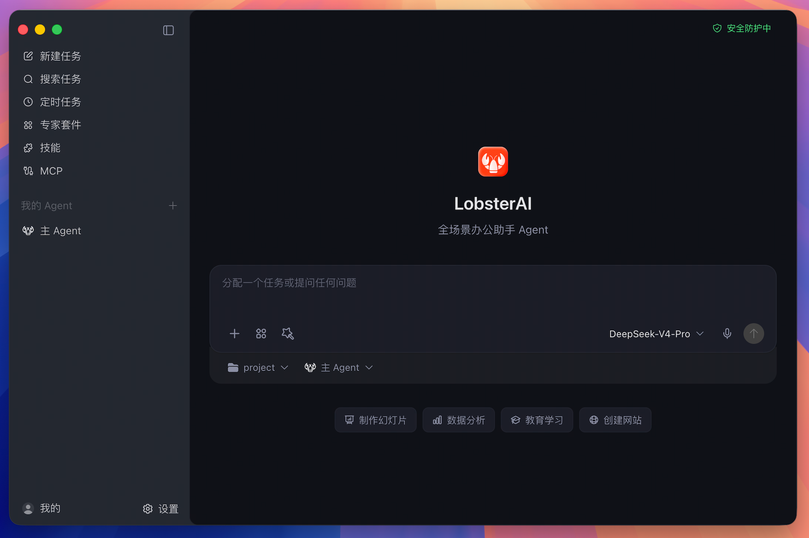

<h1 align="center">
  <br>
  qoowork
</h1>

<p align="center">
  <a href="https://github.com/qoobots/qoowork/stargazers"></a>
  <a href="LICENSE"></a>
  <a href="https://x.com/qooworkYoudao"></a>
  <a href="https://shared.ydstatic.com/market/souti/fihserChatWeb/online/2.0.7/dist/assets/wechat_group-B34qRm1G.png"></a>
  <br>
  
  
  
  
  
  
  
</p>

<p align="center">
  <a href="README.md">English</a> · 中文
</p>

<p align="center">
  <strong>全场景桌面级 AI Agent。</strong><br/>
  让 AI 进入你的真实工作环境：本地文件、终端、浏览器、IM 渠道，<br/>
  一个窗口完成从想法到交付的全流程。<br/>
  <em>国内大厂首个开源桌面 Agent，Qoobot 出品。</em>
</p>

<p align="center">
  <a href="#快速开始"><strong>快速开始</strong></a>
  &nbsp;·&nbsp;
  <a href="#核心特性"><strong>核心特性</strong></a>
  &nbsp;·&nbsp;
  <a href="#实战场景"><strong>实战场景</strong></a>
  &nbsp;·&nbsp;
  <a href="#架构设计"><strong>架构设计</strong></a>
  &nbsp;·&nbsp;
  <a href="#技术栈"><strong>技术栈</strong></a>
  &nbsp;·&nbsp;
  <a href="#本地开发"><strong>本地开发</strong></a>
  &nbsp;·&nbsp;
  <a href="#项目结构"><strong>项目结构</strong></a>
  &nbsp;·&nbsp;
  <a href="#社区与支持"><strong>社区与支持</strong></a>
</p>

<h3 align="center"><a href="https://qoowork.qoobot.com/#/download-list"><ins>下载 qoowork</ins></a></h3>

<p align="center">
  
</p>

---

## 什么是 qoowork？

**qoowork** 是一个能够进入真实工作环境的桌面级 AI Agent。它不是简单的聊天窗口，而是可以：

- 📁 **读写你的本地文件**，编辑代码、处理文档、操作表格
- 🖥️ **执行终端命令**，搭建开发环境、运行脚本、管理系统
- 🌐 **控制浏览器**，操作网页后台、自动填表、抓取数据
- 📊 **生成可视化成果**：HTML 看板、SVG 图表、视频、PPT 演示文稿
- 💬 **对接 IM 渠道**，通过微信、钉钉、飞书等远程控制 Agent
- ⏰ **定时自动执行**，每日新闻摘要、数据监控、周报生成

### 设计理念

qoowork 采用**双层架构**：

- **Cowork** — 产品与会话层，负责桌面端本地持久化、权限控制、UI 状态管理、Artifacts 渲染、Agent 管理、记忆系统、IM 绑定
- **OpenClaw** — 底层运行时与网关，负责 Agent 任务的执行、工具调用、模型推理和流式事件分发

> 这种分层让桌面层专注用户体验和数据安全，核心 AI 能力由独立的 OpenClaw 运行时承载。

---

## 快速开始

### 方式一：直接安装（推荐）

前往[官网下载页](https://qoowork.qoobot.com/#/download-list)或 [GitHub Releases](https://github.com/qoobots/qoowork/releases) 下载 macOS / Windows 安装包，开箱即用。

### 方式二：从源码运行

```bash
# 环境要求：Node.js >= 24.15.0 < 25
git clone https://github.com/qoobots/qoowork.git
cd qoowork
npm install

# 首次运行（构建 OpenClaw 运行时 + 启动应用）
npm run electron:dev:openclaw

# 后续日常开发
npm run electron:dev
```

### 配置模型

启动后，进入**设置 → 模型配置**，添加你的 API Provider：

| Provider | 需要的配置 |
| --- | --- |
| OpenAI 兼容 | API Key + Base URL + 模型名称 |
| 通义千问 | API Key |
| DeepSeek | API Key |
| 自定义 | 任意 OpenAI 兼容接口 |

支持同时配置多个模型，在会话中自由切换。

### 第一个任务

试试这些入门指令：

```
"帮我生成一个每日待办事项的 HTML 页面，包含添加、完成和删除功能，并在浏览器中打开预览。"
```

```
"分析当前文件夹下的 README.md，提取核心内容并生成一张思维导图。"
```

---

## 核心特性

### 🖥️ 桌面级 Cowork 会话

围绕本地项目和文件执行**长任务**。qoowork 会：

- 实时流式展示 Agent 的思考过程、工具调用和中间结果
- 完整保存会话历史，支持搜索、分叉和回溯
- 对文件操作、终端命令、网络访问等敏感动作**请求人工审批**
- 支持上下文令牌用量可视化，清晰展示消耗情况

### 🤖 多 Agent 工作流

- **主 Agent** 处理通用工作任务
- **专用 Agent** 为重复性场景定制：代码审查 Agent、数据分析 Agent、文档生成 Agent 等
- 每个 Agent 拥有独立的身份、模型、技能集、工作目录和 IM 绑定
- 支持 Agent 间的会话分叉和子 Agent 委派

### 🧩 专家套件

- 面向场景的能力打包：一次性安装一组关联的技能和参考信息
- 例如"财报分析套件"包含 Excel 处理、图表生成、财务指标计算和 PPT 输出技能
- 套件与单技能独立共存，同一任务可组合套件和单独技能

### 🛠️ 技能系统

`SKILLs/` 目录内置 **28+ 技能**，开箱即用：

| 分类 | 技能 |
| --- | --- |
| 📝 文档 | Word (.docx)、Excel (.xlsx)、PowerPoint (.pptx)、PDF 处理、Markdown |
| 🌐 网络 | Web 搜索、浏览器自动化、网页抓取 |
| 🎨 媒体 | 图片生成、视频生成（Remotion）、SVG 渲染 |
| 📊 数据 | 数据可视化、股票研究、趋势分析 |
| 📧 通讯 | 邮件撰写与发送、天气查询 |
| 🔧 工具 | 技能创建、Playwright 测试、内容写作 |
| 🗣️ 语音 | 语音输入 |

技能可通过 UI 界面一键启用/禁用，也支持安装第三方技能包。

### 🔌 MCP 服务

通过 **Model Context Protocol** 接入外部工具和数据源：

- 本地保存 MCP 服务配置，数据完全归属用户
- 启用的 MCP 服务自动同步到 OpenClaw 运行时
- 支持 MCP 市场，快速发现和安装社区服务
- 兼容 stdio、SSE 等多种传输协议

### ⏰ 定时任务

- 通过**自然语言描述**创建定时任务，无需编写 cron 表达式
- 可视化定时任务 UI，查看任务列表、运行历史和下次执行时间
- 内置模板：每日新闻、邮箱摘要、网站监控、周报生成、数据备份
- 任务执行结果自动保存，支持失败重试和通知

### 💬 IM 远程控制

把 Agent 接入日常聊天工具，随时随地远程指挥：

| 平台 | 状态 |
| --- | --- |
| 微信 | ✅ 支持 |
| 企业微信 | ✅ 支持 |
| 钉钉 | ✅ 支持 |
| 飞书 / Lark | ✅ 支持 |
| QQ | ✅ 支持 |
| Telegram | ✅ 支持 |
| Discord | ✅ 支持 |
| 邮件 | ✅ 支持 |
| 网易云信 IM | ✅ 支持 |
| 网易小蜜蜂 | ✅ 支持 |
| POPO | ✅ 支持 |

- 多实例支持：不同账号/渠道绑定到不同 Agent
- IM 会话自动映射到 Cowork 会话，上下文持续保持

### 📦 丰富 Artifacts

Agent 生成的成果物在桌面端**直接预览和管理**：

| Artifact 类型 | 渲染方式 |
| --- | --- |
| HTML / SVG | 内嵌浏览器沙箱渲染 |
| Mermaid 图表 | 实时 SVG 可视化 |
| 代码 | 语法高亮 + 行号 |
| 图片 / 视频 | 媒体播放器 |
| Markdown | 富文本渲染 |
| 文档 | 文件目录视图 |
| 本地服务 | 端口转发预览 |

所有 Artifacts 持久化存储，不会因会话关闭而丢失。

### 🧠 本地记忆与数据

- **SQLite 本地存储**：会话、消息、配置、Agent 定义全部保存在 `qoowork.sqlite`
- **OpenClaw 工作区记忆**：`MEMORY.md` 持久事实、`USER.md` 用户画像、`SOUL.md` Agent 人格
- **每日笔记**：`memory/YYYY-MM-DD.md` 自动记录每日工作上下文
- **跨会话延续**：偏好和项目上下文在多个会话间自动关联

---

## 实战场景

### 🏗️ 本地系统搭建

| 指令 | 效果 |
| --- | --- |
| "帮我做一个进销存系统，录入进货和销售，自动计算库存和利润，浏览器预览。" | 生成完整 Web 应用 |
| "搭建一个带搜索和分页的本地照片管理页面，读取当前文件夹下的图片。" | 文件 + Web 联动 |

### 📊 数据分析与可视化

| 指令 | 效果 |
| --- | --- |
| "基于 `sales-2025.xlsx` 做可视化看板，总结增长原因。" | Excel → 图表 + 分析 |
| "分析日志文件 `server.log`，找出 TOP 10 错误并生成修复建议。" | 日志分析 + 诊断 |

### 📑 文档与汇报

| 指令 | 效果 |
| --- | --- |
| "调研 AI Agent 市场格局，生成演示文稿。" | 研究 → 结构化 PPT |
| "把项目 specs 目录下的设计文档汇总成架构概览。" | 多文档整合 |
| "翻译 README.md 为英文并保持格式。" | 翻译 + 排版 |

### 🌐 浏览器自动化

| 指令 | 效果 |
| --- | --- |
| "每天早上打开广告后台，检查消耗和转化是否异常，总结原因。" | 网页监控 + 日报 |
| "爬取竞品价格页面，做对比分析表格。" | 数据采集 + 处理 |

### ⏰ 定时自动化

| 指令 | 效果 |
| --- | --- |
| "每个工作日 9 点收集 AI 新闻，发简洁摘要。" | 定时 + 摘要 |
| "每周五 17 点统计本周 Git 提交，生成周报。" | Git + 定时报表 |
| "每小时检查一次服务器状态页面，宕机时通过微信通知我。" | 监控 + IM 告警 |

### 💬 远程办公

| 指令 | 效果 |
| --- | --- |
| "通过微信问 Agent '分析今天的销售数据'，Agent 在电脑上执行后微信回复结果。" | IM 远程控制 |
| "出差时通过飞书让 Agent 生成客户需要的 PPT，并发送邮件。" | 远程 + 文档 + 邮件 |

---

## 架构设计

<p align="center">
  
</p>

### 三层架构

```
┌─────────────────────────────────────────────┐
│                  Renderer                     │
│  React + Redux + Tailwind                     │
│  Cowork UI │ Agent 管理 │ Artifacts 预览      │
│  技能/MCP/定时任务/IM 配置                     │
├─────────────────────────────────────────────┤
│                Main Process                   │
│  Electron 生命周期 │ IPC 通信 │ SQLite 持久化   │
│  登录鉴权 │ 日志 │ Runtime 管理 │ 技能同步       │
│  IM 网关 │ Artifact 服务                      │
├─────────────────────────────────────────────┤
│              OpenClaw Runtime                 │
│  Agent 执行 │ 工具调用 │ 模型推理               │
│  流式事件 │ 工作区记忆 │ 配置同步              │
└─────────────────────────────────────────────┘
```

### 关键模块说明

| 模块 | 文件 | 职责 |
| --- | --- | --- |
| **应用入口** | `src/main/main.ts` | Electron 生命周期管理、IPC 注册、鉴权、日志、运行时启动和服务装配 |
| **运行时管理** | `src/main/libs/openclawEngineManager.ts` | OpenClaw 网关进程生命周期、状态监控、端口分配、日志收集、重启/修复 |
| **配置同步** | `src/main/libs/openclawConfigSync.ts` | 将 qoowork 的 Provider、Model、Agent、IM 绑定、技能、MCP、工作区指令渲染为 OpenClaw 配置文件 |
| **事件适配** | `src/main/libs/agentEngine/openclawRuntimeAdapter.ts` | 将 OpenClaw 网关原生事件翻译为 Cowork 流式事件格式 |
| **路由分发** | `src/main/libs/agentEngine/coworkEngineRouter.ts` | Cowork 运行时路由，当前统一路由到 OpenClaw |
| **数据存储** | `src/main/coworkStore.ts` | Cowork 会话、消息、配置、Agent、记忆元数据的 CRUD 操作 |
| **Agent 管理** | `src/main/agentManager.ts` | Agent 的创建、更新、删除和预设模板安装 |
| **技能管理** | `src/main/skillManager.ts` | 内置/用户技能的同步、安装/升级、安全扫描、启用状态和路由配置 |
| **IM 网关** | `src/main/im/` | 多平台 IM 配置、状态、消息投递、会话映射、媒体处理和配对 |
| **MCP 服务** | `src/main/mcp/` | MCP 存储、运行时、市场和启动解析 |

---

## 技术栈

| 层级 | 技术 | 版本 |
| --- | --- | --- |
| **桌面框架** | Electron | 40 |
| **前端框架** | React | 18 |
| **状态管理** | Redux Toolkit | — |
| **UI 样式** | Tailwind CSS | — |
| **构建工具** | Vite | 6 |
| **类型系统** | TypeScript | 5 |
| **测试框架** | Vitest | — |
| **代码规范** | ESLint + Prettier | — |
| **Git 规范** | Commitlint + Husky | — |
| **本地存储** | SQLite (better-sqlite3) | — |
| **日志** | electron-log | — |
| **打包** | electron-builder | — |
| **AI 运行时** | OpenClaw | v2026.6.1 |

### 开发环境要求

| 依赖 | 版本要求 |
| --- | --- |
| Node.js | `>= 24.15.0 < 25` |
| npm | 随 Node.js 自带 |
| Git | 任意现代版本 |

---

## 本地开发

### 常用命令

```bash
# 首次启动（构建 OpenClaw runtime + 启动）
npm run electron:dev:openclaw

# 日常开发启动（Vite 热更新 + Electron）
npm run electron:dev

# 生产构建
npm run build

# Electron 主进程 / preload TypeScript 编译
npm run compile:electron

# 运行测试
npm test                     # 全量 Vitest 测试
npm test -- cowork           # 仅测试 cowboy 相关
npm test -- logger           # 仅测试 logger 相关

# 代码检查
npm run lint                 # 全量 ESLint（可能暴露历史债务）
npx eslint --ext ts,tsx --report-unused-disable-directories --max-warnings 0 <files>

# 打包分发
npm run dist:mac             # macOS
npm run dist:win             # Windows
npm run dist:linux           # Linux
```

### OpenClaw Runtime 构建

OpenClaw 作为独立的运行时组件，需要预先构建。锁定的版本和插件列表在 `package.json` 的 `openclaw` 字段。

```bash
# 完整构建流程（推荐）
npm run openclaw:runtime:host

# 分步控制
npm run openclaw:ensure      # 拉取源码
npm run openclaw:patch       # 应用补丁
npm run openclaw:bundle      # 打包网关
npm run openclaw:plugins     # 安装插件
npm run openclaw:prune       # 裁剪冗余文件

# 环境变量
OPENCLAW_SRC=/path/to/openclaw           # 指定源码路径
OPENCLAW_SKIP_ENSURE=1                   # 跳过版本检测
OPENCLAW_FORCE_BUILD=1                   # 强制重建
```

### 打包说明

打包会将 OpenClaw runtime 内置到安装包的 `Resources/cfmind` 目录。

<details>
<summary>详细打包选项（点击展开）</summary>

```bash
# macOS 架构选项
npm run dist:mac               # 当前架构
npm run dist:mac:x64           # Intel 芯片
npm run dist:mac:arm64         # Apple Silicon
npm run dist:mac:universal     # 通用二进制

# Windows
npm run dist:win

# Linux
npm run dist:linux
```

**离线打包**：Windows 构建默认会下载便携 Python 运行时。离线环境可通过以下环境变量指定本地路径：

- `qoowork_PORTABLE_PYTHON_ARCHIVE` — 本地 Python 压缩包路径
- `qoowork_PORTABLE_PYTHON_URL` — 私有源下载地址
- `qoowork_WINDOWS_EMBED_PYTHON_VERSION` — 指定 Python 版本
- `qoowork_WINDOWS_EMBED_PYTHON_URL` — 指定 Python 下载地址
- `qoowork_WINDOWS_GET_PIP_URL` — 指定 get-pip.py 地址

</details>

---

## 项目结构

```
qoowork/
├── src/
│   ├── main/                    # Electron 主进程
│   │   ├── main.ts              # 应用入口，生命周期管理
│   │   ├── preload.ts           # Preload 脚本，IPC 桥接
│   │   ├── coworkStore.ts       # Cowork 数据存储层
│   │   ├── sqliteStore.ts       # SQLite 初始化和迁移
│   │   ├── agentManager.ts      # Agent CRUD 管理
│   │   ├── skillManager.ts      # 技能同步管理
│   │   ├── libs/
│   │   │   ├── openclawEngineManager.ts   # OpenClaw 运行时管理
│   │   │   ├── openclawConfigSync.ts      # 配置同步
│   │   │   └── agentEngine/
│   │   │       ├── openclawRuntimeAdapter.ts  # 事件适配器
│   │   │       └── coworkEngineRouter.ts      # 运行时路由
│   │   ├── im/                  # IM 网关（微信/钉钉/飞书等）
│   │   └── mcp/                 # MCP 服务管理
│   ├── renderer/                # React 渲染进程
│   │   ├── App.tsx              # 顶层应用组件
│   │   ├── store/               # Redux Store + Slices
│   │   ├── services/            # IPC 封装 + 业务服务
│   │   └── components/
│   │       ├── cowork/          # 主会话界面
│   │       ├── agent/           # Agent 管理界面
│   │       ├── agentSidebar/    # 侧边栏导航
│   │       ├── artifacts/       # Artifact 预览面板
│   │       ├── skills/          # 技能管理界面
│   │       ├── mcp/             # MCP 管理界面
│   │       └── scheduledTasks/  # 定时任务界面
│   └── shared/                  # 主进程/渲染进程共享
│       ├── agent/
│       ├── cowork/
│       ├── mcp/
│       └── auth/
├── SKILLs/                      # 内置技能包（28+）
├── scripts/                     # 构建脚本（110+）
├── specs/                       # 设计文档（145+）
│   ├── features/                # 功能设计
│   ├── refactors/               # 重构设计
│   └── bugfixes/                # Bug 修复设计
├── tests/                       # 测试文件
├── docs/                        # 用户文档
├── resources/                   # 打包资源
├── public/                      # 静态资源（图标等）
├── openclaw-extensions/         # 本地 OpenClaw 扩展
├── vendor/openclaw-runtime/     # OpenClaw 运行时构建产物
└── build/                       # electron-builder 配置资源
```

---

## 配置指南

### 工作目录

在设置中指定 Agent 的**工作目录**（默认启动路径）。Agent 的所有文件操作默认相对于此目录，建议设置为你的日常项目根目录。

### 权限控制

qoowork 提供精细的权限策略：

| 权限级别 | 说明 |
| --- | --- |
| **始终允许** | 自动批准，不弹窗询问 |
| **每次询问** | 每次触发时弹窗确认（默认） |
| **始终拒绝** | 自动拒绝 |

可单独控制以下权限类型：文件读写、终端命令执行、网络请求、浏览器操作、IM 消息发送、定时任务创建。

### 会话持久化

- 所有会话自动保存在本地 SQLite
- 支持会话搜索、标记和归档
- 上下文胶囊功能可在长会话中保持关键信息
- `MEMORY.md` 和每日笔记提供跨会话的长期记忆

---

## 安全与隐私

qoowork 将数据安全放在首位：

| 安全措施 | 实现方式 |
| --- | --- |
| **进程隔离** | Renderer 启用 contextIsolation，禁用 nodeIntegration，沙箱模式 |
| **IPC 安全** | 所有 Renderer→Main 通信经 contextBridge 暴露的限定 API |
| **权限门控** | 文件、终端、网络等敏感操作需用户审批 |
| **数据本地化** | 所有数据存于本地 SQLite，不上传服务器 |
| **日志脱敏** | 敏感信息（API Key、Token）在日志中自动脱敏 |
| **OpenClaw 隔离** | OpenClaw 运行时独立进程，状态目录与用户数据隔离 |

---

## 社区与支持
### 反馈与贡献

- **Bug 报告**：使用 GitHub Issue 模板提交，附上日志和复现步骤
- **功能建议**：在 Discussions 中参与讨论
- **代码贡献**：Fork 仓库后提交 PR，包含简要说明、关联 Issue 和改动截图
- **PR 规范**：涉及 Electron IPC、存储、runtime 或窗口行为时请在 PR 中说明

### 日志位置

排查问题时，日志文件位于：

| 系统 | 主进程日志 | OpenClaw 日志 |
| --- | --- | --- |
| Windows | `%APPDATA%/qoowork/logs/main-YYYY-MM-DD.log` | `%APPDATA%/qoowork/openclaw/logs/gateway-YYYY-MM-DD.log` |
| macOS | `~/Library/Logs/qoowork/main-YYYY-MM-DD.log` | `~/Library/Logs/qoowork/openclaw/logs/gateway-YYYY-MM-DD.log` |
| Linux | `~/.config/qoowork/logs/main-YYYY-MM-DD.log` | `~/.config/qoowork/openclaw/logs/gateway-YYYY-MM-DD.log` |

---

## 常见问题

<details>
<summary><strong>qoowork 和普通 AI 聊天工具有什么区别？</strong></summary>

qoowork 不是聊天窗口，而是能操控你电脑真实工作环境的 Agent。它可以读写文件、执行命令、控制浏览器、操作 IM，从"对话"升级为"协作"。
</details>

<details>
<summary><strong>我的数据会上传到哪里？</strong></summary>

所有会话数据、配置、记忆都保存在本地 SQLite 数据库中。只有调用 AI 模型时，Prompt 和上下文会发送给你配置的 API Provider（如 OpenAI、DeepSeek 等）。qoowork 团队不收集任何用户数据。
</details>

<details>
<summary><strong>支持哪些 AI 模型？</strong></summary>

任何兼容 OpenAI API 格式的模型都可以接入，包括 GPT-4o、Claude、DeepSeek、通义千问、文心一言、Moonshot 等。在设置中添加 API Key 和 Base URL 即可。
</details>

<details>
<summary><strong>可以离线使用吗？</strong></summary>

qoowork 本身是离线桌面应用，但 Agent 的推理能力依赖云端大模型 API，需要网络连接。你可以通过 Ollama 等工具在本地部署模型，配置为 Provider 后即可离线使用。
</details>

<details>
<summary><strong>如何同时使用多个 IM 平台？</strong></summary>

在设置 → IM 配置中分别添加各平台的凭据。每个平台可配置多个实例（多账号），每个实例可绑定到不同的 Agent。
</details>

---

## Star History

[](https://www.star-history.com/#qoobots/qoowork&type=date&legend=top-left)

## 许可证

本项目采用 [GNU Affero General Public License v3 (AGPL-3.0)](LICENSE) 开源协议。

> 这意味着你可以自由使用、修改和分发本软件，但任何衍生作品也必须以 AGPL-3.0 协议开源，包括通过网络提供服务的情形。

---


