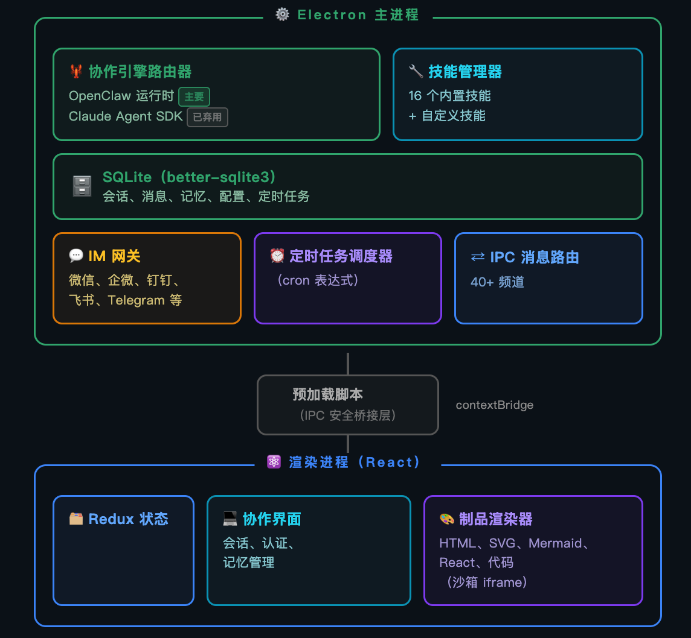

# 系统架构

## 概述

QooWork 是一个 Electron + React 桌面应用，采用双层架构设计：

- **Cowork**：产品与会话层，负责用户体验、本地持久化、IPC 通信、状态管理
- **OpenClaw**：底层 AI Agent 运行时与网关，负责模型调度、工具执行、IM 渠道集成、定时任务

```
┌─────────────────────────────────────────────────┐
│                 Electron 桌面壳                    │
│  ┌───────────────────┐  ┌────────────────────┐  │
│  │   Renderer 进程     │  │    Main 进程         │  │
│  │  (React + Redux)   │  │  (Node.js + SQLite) │  │
│  │   - UI 渲染         │  │   - IPC 路由         │  │
│  │   - 会话交互        │──│   - OpenClaw 管理    │  │
│  │   - 状态管理        │  │   - 配置同步         │  │
│  └───────────────────┘  │   - IM 网关           │  │
│                          │   - 技能/MCP 管理     │  │
│                          └──────────┬─────────┘  │
│                                     │            │
│                          ┌──────────▼─────────┐  │
│                          │  OpenClaw 运行时     │  │
│                          │  (子进程/网关)       │  │
│                          │   - AI 模型调度      │  │
│                          │   - 工具执行         │  │
│                          │   - 对话会话管理     │  │
│                          │   - 定时任务         │  │
│                          └────────────────────┘  │
└─────────────────────────────────────────────────┘
```



## 进程模型

### Main 进程

入口：`src/main/main.ts`

职责：
- Electron 生命周期管理（窗口、托盘、快捷键、睡眠阻止）
- IPC 通信中枢（`contextBridge` + `ipcMain`）
- OpenClaw 网关进程管理（启动、重启、日志、就绪检测）
- Cowork 配置与状态同步到 OpenClaw
- SQLite 数据持久化（会话、消息、Agent、记忆、IM 配置）
- IM 渠道网关状态管理与消息分发
- Skills 同步、安装、升级、安全扫描
- MCP 服务器管理与启动解析
- 定时任务（Scheduled Tasks）元数据管理
- Artifact 预览/分享处理
- 应用更新检测与下载

安全策略：
- `contextIsolation: true`
- `nodeIntegration: false`
- 沙箱模式启用
- 渲染进程通过 `preload.ts` 暴露的有限 API 与主进程通信

### Renderer 进程

入口：`src/renderer/App.tsx`

技术栈：React 18 + Redux Toolkit + Tailwind CSS

核心组件模块：
- `components/cowork/` — 主对话界面、输入框、权限控制、Thinking/Tool 展示、上下文用量、会话 Fork
- `components/agent/` — Agent 创建与设置
- `components/agentSidebar/` — Agent 树、会话树、子 Agent 会话
- `components/artifacts/` — Artifact 面板、预览卡、文件目录渲染
- `components/scheduledTasks/` — 定时任务列表、表单、运行历史
- `components/im/` — IM 平台配置与多实例管理
- `components/skills/` — 技能浏览与启用管理
- `components/mcp/` — MCP 服务管理

### Preload 脚本

入口：`src/main/preload.ts`

通过 `contextBridge` 将主进程 API 安全暴露给渲染进程，包括：
- Cowork IPC（创建/连接/停止会话、流式消息、权限请求）
- Agent CRUD、Skills、MCP、IM 配置
- Scheduled Tasks、Artifacts
- 系统信息（Electron 版本、平台、路径）

## 数据存储

### SQLite (`qoowork.sqlite`)

位置：`electron.app.getPath('userData')/qoowork.sqlite`

核心表：
| 表名 | 用途 |
|------|------|
| `kv` | 应用级 KV 存储（包括认证/配置标志） |
| `cowork_sessions` | 本地会话记录 |
| `cowork_messages` | 会话消息记录 |
| `cowork_session_capsules` | 会话上下文胶囊（continuity） |
| `cowork_config` | Cowork 设置（工作目录、执行模式、Agent 引擎等） |
| `agents` | 自定义/预设 Agent 配置 |
| `user_memories` / `user_memory_sources` | 本地记忆追踪 |
| `im_config` | IM 平台配置 |
| `im_session_mappings` | IM 对话 → Cowork 会话映射 |
| `mcp_servers` / `mcp_launch_resolutions` | MCP 配置与启动解析 |
| `user_plugins` | 用户安装的 OpenClaw 插件 |
| `subagent_runs` / `subagent_messages` | 子 Agent 运行与消息 |
| `scheduled_task_meta` | 本地定时任务元数据 |

### OpenClaw 运行时状态

位置：`electron.app.getPath('userData')/openclaw/`

关键路径：
- `state/openclaw.json` — 生成的 OpenClaw 配置
- `state/workspace-main` — 主 Agent 工作区
- `state/workspace-{agentId}` — 非主 Agent 工作区

工作区文件：
- `AGENTS.md` — 工作区指令（QooWork 管理区段）
- `MEMORY.md` — 持久化记忆事实
- `memory/YYYY-MM-DD.md` — 每日笔记
- `USER.md` — 用户画像
- `SOUL.md` — Agent/系统提示词
- `IDENTITY.md` — Agent 身份

> **注意**：用户可见的工作目录是会话 cwd，不要与 OpenClaw Agent 工作区混淆。

## 核心模块依赖关系

```
src/main/libs/
├── openclawEngineManager.ts    ← OpenClaw 网关进程管理
├── openclawConfigSync.ts       ← QooWork 状态 → OpenClaw 配置同步
├── agentEngine/
│   ├── openclawRuntimeAdapter.ts  ← OpenClaw 事件 → Cowork 流事件
│   └── coworkEngineRouter.ts      ← Cowork 运行时路由（仅 OpenClaw）
├── coworkStore.ts              ← Cowork 会话/消息 CRUD
├── sqliteStore.ts              ← 数据库初始化与迁移
├── agentManager.ts             ← Agent CRUD + 预设安装
├── skillManager.ts             ← 技能管理
├── im/                         ← IM 渠道处理
└── mcp/                        ← MCP 服务管理
```

## 日志体系

| 类型 | 位置 | 保留策略 |
|------|------|----------|
| Main 日志 | `userData/logs/main-YYYY-MM-DD.log` | 7 天，单文件最大 80 MB |
| OpenClaw 网关日志 | `userData/openclaw/logs/gateway-YYYY-MM-DD.log` | 3 天 |
| OpenClaw 运行时日志 | 临时目录（Windows 优先 `D:/tmp/openclaw` 风格路径）| 系统默认 |

## 扩展能力

### 本地 OpenClaw 插件

位于 `openclaw-extensions/`：
- `ask-user-question/` — Agent 执行中向用户提问
- `mcp-bridge/` — MCP 桥接
- `qoowork-media-generation/` — 媒体生成（文生图、图生视频等）

### 第三方 OpenClaw 插件

由 `package.json` 中 `openclaw.plugins` 管理：
- 钉钉 (`dingtalk-connector`)
- 飞书 (`openclaw-lark`)
- QQ Bot (`qqbot`)
- Discord
- 企业微信 (`wecom-openclaw-plugin`)
- 微信 (`openclaw-weixin`)
- POPO、网易云信、网易蜂巢（可选）

### Skills 技能系统

位于 `SKILLs/`，通过 `skills.config.json` 管理 28+ 内置技能，覆盖文档处理（PDF/DOCX/XLSX/PPTX）、网页搜索、前端设计、股票分析、天气查询等场景。

### MCP 协议

支持标准 MCP（Model Context Protocol），内置 MCP 服务器管理、启动解析与市场集成。

## 架构演进历史

以下记录项目发展中重要的架构决策与重构事件。

### 数据库引擎迁移：sql.js → better-sqlite3

- **时间**：2026-04
- **决策**：从 `sql.js`（WASM 内存 SQLite）迁移到 `better-sqlite3`（原生 Node.js addon），并启用 WAL 模式
- **动机**：`sql.js` 每次写入需完整序列化数据库文件，大数据库下 IO 开销过大；WASM 内存限制导致大数据量场景不稳定
- **方案**：评估了三种方案（维持 sql.js / 批量刷盘 / better-sqlite3+WAL），最终采用 better-sqlite3 + WAL 模式
- **影响**：显著提升写入性能和并发能力；数据库文件可直接用 SQLite 工具检查；需在 `package.json` 中声明原生模块依赖

### yd_cowork 引擎移除

- **时间**：2026-04
- **决策**：移除 `yd_cowork` 作为备用运行时的支持，统一为 OpenClaw 单一运行时
- **动机**：双运行时增加维护复杂度，且 yd_cowork 在新架构中不再具备独立价值
- **影响**：Cowork 运行时路由简化为仅 OpenClaw；旧文档中 `yd_cowork` 相关内容不再适用；历史命名（如 `cowork:*` IPC 通道、`claude_session_id`）作为兼容名保留

### MCP 原生迁移

- **时间**：2026-05
- **决策**：将 MCP 服务器管理从 QooWork 自定义实现迁移到 OpenClaw 原生 MCP 能力
- **动机**：OpenClaw 原生支持更完整的 MCP 规范，减少 QooWork 侧重复实现
- **影响**：MCP 管理逻辑精简；启动解析（Launch Resolution）统一由 OpenClaw 处理

### OpenClaw 工作区解耦

- **时间**：2026-05
- **决策**：将 Agent 工作区管理从 QooWork 主流程中解耦，交由 OpenClaw 独立管理
- **动机**：降低 QooWork 对 OpenClaw 内部状态的耦合，简化配置同步逻辑
- **影响**：工作区路径管理规则变更；`openclawConfigSync` 集中管理配置生成

### Providers 重构

- **时间**：2026-04
- **决策**：重构模型供应商（Providers）的配置结构与同步机制
- **动机**：原有供应商配置分散在多处，新增供应商支持困难
- **影响**：统一 Provider 配置格式；扩展新模型供应商更简便

### 启动网关优化

- **时间**：2026-05
- **决策**：优化应用启动时 OpenClaw 网关的就绪检测与启动流程
- **动机**：启动阶段因 OpenClaw 初始化耗时，用户需等待较长时间
- **影响**：采用异步预热策略，减少启动等待时间；网关未就绪时提供降级提示

### Agent 模型无效修复

- **时间**：2026-04
- **决策**：修复 Agent 切换模型后配置无效的问题
- **动机**：模型配置变更后需重启网关才能生效，用户体验差
- **影响**：增强配置热更新能力，减少不必要的网关重启

### OpenClaw 版本升级

- **时间**：2026-06
- **决策**：将 OpenClaw 从旧版本升级到 `v2026.6.1`
- **动机**：新版本提供更稳定的工具执行、改进的会话管理、更完整的渠道支持
- **影响**：同步更新补丁文件；重新验证所有插件兼容性
